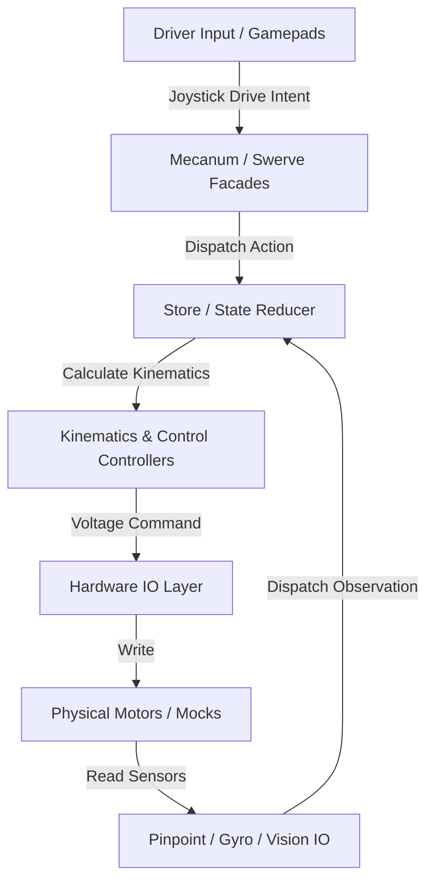

# ARESLib-Kotlin: AI & Developer Guidelines

This document serves as the absolute source of truth for repository structure, building, testing, and coding standards. AI agents and developers must strictly adhere to these directives.

---

## 1. Project Overview & Architecture

`ARESLib-Kotlin` is a high-performance, functional, cross-platform (FTC and FRC) robotics library. The codebase is designed around two core principles: **Immutable State Representation** (Redux-style flow) and **Decoupled Hardware Interfaces** (IO Layer pattern).



### Core Architecture Constraints:
1. **Redux Store Architecture**: 
   * **State**: The `RobotState` and its sub-states (`DriveState`, `SuperstructureState`, etc.) are 100% immutable data classes.
   * **Actions**: All state updates occur by dispatching `RobotAction` objects.
   * **Reducers**: State transitions are handled exclusively through pure, deterministic reducer functions (e.g., `rootReducer`).
2. **Unified Simulation Clock**:
   * **CRITICAL**: Never call `System.currentTimeMillis()` or `System.nanoTime()` inside library code.
   * Always use `com.areslib.util.RobotClock.currentTimeMillis()` to ensure that simulation logs and replay runs are perfectly deterministic and free from wall-clock drift.
3. **Android/RoboRIO GC Allocation Budget**:
   * Drivetrain update cycles, state-space controller loops, and pathfinders execute at high frequencies (50Hz - 100Hz).
   * **CRITICAL**: Object allocations are prohibited inside hot paths (e.g. `update()`, trajectory sampling, VFH steering loops). 
   * Always use pre-allocated buffers, primitive types, and object pools (like `Valley` pools in `VFHPlanner`) to maintain a zero-allocation footprint.
4. **Decoupled Hardware IO Layer**:
   * All hardware interactions are abstracted through thin IO interfaces (e.g. `MecanumHardwareIO`, `PinpointIO`).
   * The actual implementation is split between physical SDK implementations (`ftc-hardware/`) and robust mock components (`ftc-mocks/`), enabling 100% offline desktop-level simulation.

---

## 2. Directory Structure

* **`core/`**: Pure mathematical, planning, and control logic. Fully decoupled from FRC and FTC SDKs.
  * `src/main/kotlin/com/areslib/state/`: Immutable Redux state definitions.
  * `src/main/kotlin/com/areslib/control/`: DARE-converged LQR controllers, Kalman observers, gravity feedforwards.
  * `src/main/kotlin/com/areslib/math/`: EKF localization, Mahalanobis outlier filtering, geometry wrappers.
  * `src/main/kotlin/com/areslib/pathing/`: Theta* any-angle pathfinders, costmap inflation, jerk-limited S-curve generators, and VFH+.
  * `src/main/kotlin/com/areslib/subsystem/`: Subsystem facades and Ares robot definitions.
* **`ftc-hardware/`**: FTC-specific hardware wrapping, GoBilda Pinpoint and Limelight integration, and the student-facing Mecanum robot facade.
* **`ftc-mocks/`**: Stubbed, light implementation of Qualcomm and external FTC APIs, enabling core compilation and desktop test executions without Android hardware.
* **`frc-hardware/`**: FRC-specific kinematics, Swerve Facades, WPILib adapters, and the `FrcBaseRobot` scaffold (parallel to `FtcBaseRobot`). Season-specific subsystem code (state, reducers, actions, subsystem facades) lives in the team repository (`ARES-FRC`).
* **`simulator/`**: Dynamic physics simulator and dynamic visualizers.

---

## 3. Build & Test Commands

Always default to using the local Gradle wrapper (`gradlew.bat` on Windows, `./gradlew` on Linux/WSL2).

### Standard Development Commands:
* **Compile Kotlin Code**:
  ```powershell
  .\gradlew.bat compileKotlin compileTestKotlin
  ```
* **Run Entire Test Suite**:
  ```powershell
  .\gradlew.bat test
  ```
* **Run Specific Module Tests**:
  ```powershell
  .\gradlew.bat :core:test
  .\gradlew.bat :ftc-hardware:test
  ```
* **Publish to Local Maven Repository (Transitive Dependencies Packaged)**:
  ```powershell
  .\gradlew.bat publishToMavenLocal
  ```
* **Clean Build Cache**:
  ```powershell
  .\gradlew.bat clean build
  ```

---

## 4. Coding Conventions

1. **Kotlin Features**:
   * Leverage Kotlin DSLs for student configuration: `aresRobot { ... }` and `ftcMecanumRobot(hardwareMap) { ... }`.
   * Use trailing lambdas and functional programming idioms.
2. **KDoc API Documentation**:
   * All public classes, parameters, facades, and mathematical algorithms must be documented using descriptive inline KDoc formatting.
   * Document specific math equations, coordinate directions, positive/negative rotations, and expected physical units (meters, radians, seconds).
3. **Redux Reducer Safety**:
   * Reducer logic must be pure. No side-effects, I/O calls, or clock calls inside reducers.
   * Use `.copy()` on state data classes to transition values.

---

## 5. Coordinate Systems & Heading Convention

This section documents the **canonical coordinate and heading conventions** used across the entire ARES ecosystem (ARESLib-Kotlin, ARES-FTC, ARES-Analytics, simulator). Failure to follow these conventions has caused real bugs. Reference this section before writing any code that touches heading, rotation, or field coordinates.

### 5.1 Field Coordinate System (FTC)
- **Origin**: Center of the FTC field
- **+X axis**: One of the side walls (e.g., audience or back wall depending on the game year). *Note: In older "diamond" field configurations, +X points toward the blue alliance wall.*
- **+Y axis**: Toward the blue alliance station wall (in standard rectangular configurations).
- **-Y axis**: Toward the red alliance station wall (true for both rectangular and diamond configurations).
- **Units**: Meters

### 5.2 Heading Convention (CCW-Positive, Math Standard)
- **0°**: Facing +X
- **90° (+π/2)**: Facing +Y (toward blue alliance wall)
- **180° (π)**: Facing -X
- **-90° (-π/2)**: Facing -Y (toward red alliance wall)
- **Direction**: Counter-clockwise positive (standard math convention)
- **Units**: Radians internally, degrees for display only

### 5.3 Hardware Boundary: GoBilda Pinpoint
The GoBilda Pinpoint odometry computer outputs **counter-clockwise-positive** (CCW+) heading natively IF mounted right-side up. However, many physical robot mounts place the Pinpoint upside down, causing it to output **clockwise-positive** (CW+) natively. 
To align with the library's CCW-positive standard, `PinpointIO.kt` exposes an `isHeadingCcwPositive` parameter (defaulting to `false` via `FtcBaseRobot.pinpointIsCcwPositive`). 

```kotlin
// PinpointIO.kt — hardware boundary
val headingMult = if (isHeadingCcwPositive) 1.0 else -1.0
val rawHeading = headingMult * driver.getHeading(AngleUnit.RADIANS) 
```

**CRITICAL**: The heading is forced to CCW-positive at `PinpointIO`. Do NOT add negations elsewhere in the pipeline. It remains CCW-positive from `PinpointIO` onward through the EKF, Redux store, telemetry, and dashboard.

### 5.4 Simulator Heading Pipeline
The Dyn4j physics engine uses CCW-positive heading natively (same as our convention). To simulate the real GoBilda hardware:

```
Dyn4j body (CCW+) → MecanumRobotDouble.updateSensors() passes CCW+ directly 
→ GoBildaPinpointDriver mock (CCW+) → PinpointIO passes CCW+ 
→ DriveReducer → EKF → Telemetry
```

### 5.5 ARES-Analytics Dashboard Field Canvas
The FTC field-to-canvas coordinate transform **swaps and negates axes**:

```kotlin
// FieldCanvasUtils.kt
canvasX = (-fieldY / fieldWidth + 0.5) * canvasWidth
canvasY = (-fieldX / fieldHeight + 0.5) * canvasHeight
```

This means:
- Field +X → Canvas UP
- Field +Y → Canvas LEFT
- The robot icon arrow points RIGHT (+canvasX) at zero rotation
- A **-90° offset** is applied to the heading rotation in `PathRenderer.kt` to compensate

**CRITICAL**: If you modify the field-to-canvas transform or the robot icon drawing, you MUST verify the -90° heading offset is still correct.

### 5.6 Telemetry Topic Map

| NT4 Topic | Source | Content | Units |
|---|---|---|---|
| `Drive/Odom_Heading` | OpMode (ARESNetworkStatePublisher) | Raw PinpointIO heading (CCW+) | radians |
| `Drive/Drive_Heading` | OpMode (ARESNetworkStatePublisher) | EKF-fused heading (CCW+) | radians |
| `ARES/EstimatedPose/2` | Sim (TelemetryPublisher) | Ground truth Dyn4j heading (CCW+) | radians |
| `pinpoint_heading` | OpMode (FtcTelemetryManager) | EKF estimated heading (confusing name!) | radians |

### 5.7 Motor Hardware Names
The FTC robot registers motors with these hardware map names: `fl`, `fr`, `rl`, `rr` (front-left, front-right, **rear-left**, **rear-right**). Note: NOT `bl`/`br`. Dashboard visualizers must handle BOTH naming conventions (`bl`↔`rl`, `br`↔`rr`).

---

## 6. Cloud Telemetry & Networking Guidelines

1. **ARES-Analytics Gateway Architecture**:
   * The backend gateway (`aresfirst-portal`) runs on Ktor in Google Cloud Run. It accepts high-throughput payloads (Parquet) via secure GCS Signed URLs.
   * The gateway **does not** accept raw `.jsonl` files directly from robots.
2. **Offline-First Robot Operations**:
   * FTC Control Hubs and FRC RoboRIOs operate without internet access during competition matches.
   * Log uploading must follow the **Desktop Pull Architecture**:
     * The `LogManagerServer` (NanoHTTPD) running on port `5002` must expose local endpoints (like `/api/download`) to serve raw log files locally.
     * The ARES-Analytics desktop application pulls these logs to the driver station laptop, parses them into SQLite, and then the laptop handles the delta-sync and GCS uploads to the cloud.


## 7. Audit-Enforced Invariants

Following the multi-agent swarm audit, the following invariants MUST be strictly observed by AI agents:
1. **Zero-GC Hot Paths:** Absolutely NO reflection (getMethod) or dynamic heap allocations (DoubleArray, Rotation2d instantiations) inside 50Hz update() loops across FTC or FRC targets.
2. **Offline-First Networking:** Never write code that attempts to push data directly to Google Cloud or Zulip from the robot. All log uploading MUST go through local subnet fetches.
3. **Thread Purity:** Never launch un-cancellable GlobalScope.launch jobs for background hardware tasks.

